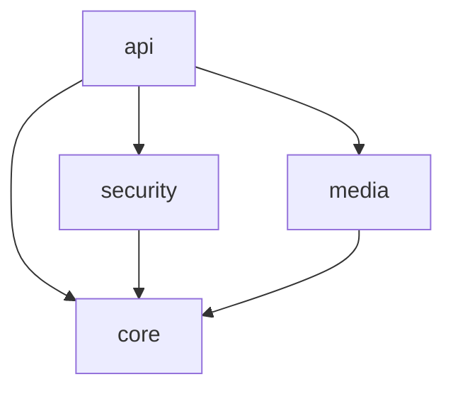

# CamCheck Backend

This is the backend service for CamCheck, a real-time camera monitoring and streaming application. The backend is built using Spring Boot and follows a modular architecture.

## Project Structure

The backend is organized into several modules:

```
backend/
├── api/                 # REST API endpoints and controllers
├── core/               # Core functionality and shared components
├── media/              # Media processing and streaming
├── security/           # Authentication and authorization
└── pom.xml            # Parent POM file
```

### Modules

#### API Module (`api/`)
- REST API endpoints
- WebSocket controllers
- Request/response models
- API documentation (OpenAPI/Swagger)
- Main application entry point

#### Core Module (`core/`)
- Domain models
- Common utilities
- Shared interfaces
- Database entities and repositories
- Base services

#### Media Module (`media/`)
- Video/image processing
- Media streaming
- WebRTC functionality
- Recording management
- Compression and optimization

#### Security Module (`security/`)
- Authentication
- Authorization
- JWT handling
- Security configuration
- User management

## Technology Stack

- Java 17
- Spring Boot 3.2.0
- Spring Security
- Spring WebSocket
- Spring Data JPA
- H2 Database (for development)
- JWT for authentication
- WebRTC for real-time communication
- OpenAPI/Swagger for documentation

## Development Setup

1. Prerequisites:
   - Java 17 or higher
   - Maven 3.8 or higher
   - IDE with Spring Boot support (IntelliJ IDEA recommended)

2. Build the project:
   ```bash
   mvn clean install
   ```

3. Run the application:
   ```bash
   cd api
   mvn spring-boot:run
   ```

4. Access the application:
   - API: http://localhost:8080/api/v1
   - Swagger UI: http://localhost:8080/swagger-ui.html
   - H2 Console: http://localhost:8080/h2-console

## Configuration

Configuration files are located in each module's `src/main/resources` directory:

- `application.yml` - Common configuration
- `application-dev.yml` - Development profile
- `application-prod.yml` - Production profile

Environment-specific configurations should be provided through environment variables or external configuration files.

## Testing

Each module contains its own test suite. Run tests using:

```bash
mvn test
```

## API Documentation

API documentation is available through Swagger UI when running the application. The documentation includes:

- Available endpoints
- Request/response models
- Authentication requirements
- Example requests

## Contributing

1. Create a feature branch from `main`
2. Make your changes
3. Write/update tests
4. Run the test suite
5. Submit a pull request

## Code Style

The project follows standard Java code style conventions:

- Use 4 spaces for indentation
- Follow Java naming conventions
- Write descriptive method and variable names
- Include JavaDoc for public methods
- Keep methods focused and concise

## Module Dependencies



- `api` depends on all other modules
- `security`, `media` depend on `core`
- `core` has no dependencies on other modules

## Building for Production

1. Set production configuration:
   ```bash
   export SPRING_PROFILES_ACTIVE=prod
   ```

2. Build the application:
   ```bash
   mvn clean package -P prod
   ```

3. Run the application:
   ```bash
   java -jar api/target/camcheck-api-1.0.0-SNAPSHOT.jar
   ```

## Monitoring

The application includes Spring Boot Actuator endpoints for monitoring:

- Health check: `/actuator/health`
- Metrics: `/actuator/metrics`
- Info: `/actuator/info`

## Security

- All endpoints are secured by default
- Authentication is required for most endpoints
- JWT tokens are used for API authentication
- WebSocket connections require authentication
- CORS is configured for frontend applications 